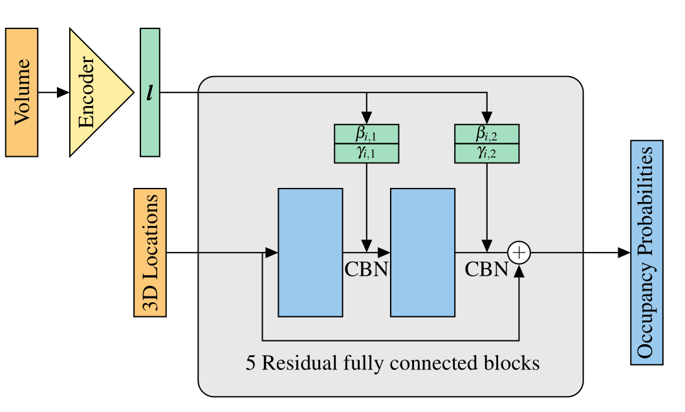
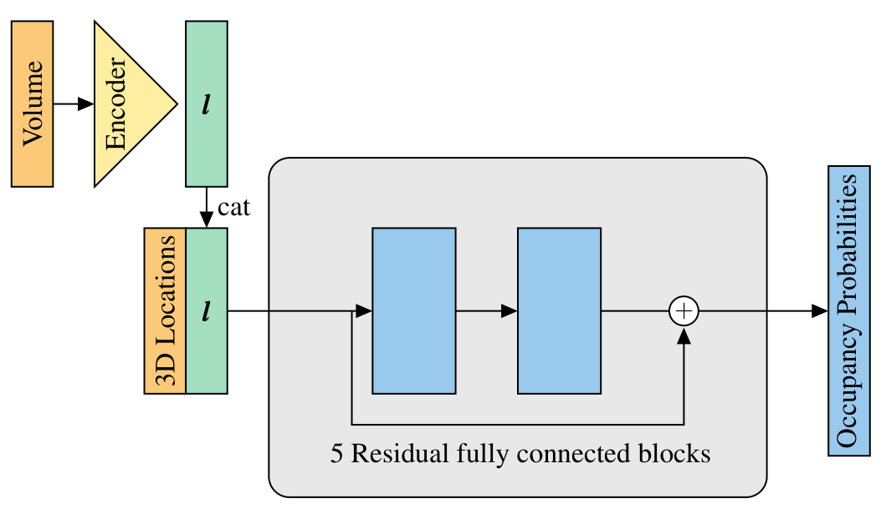

# Scalable 3D Semantic Segmentation for Gun Detection in CT Scans

[](https://github.com/ChristophReich1996/3D_Baggage_Segmentation/blob/master/LICENSE)

This repo implements a 3D superresolution segmentation task for an airport baggage dataset.

__*Our final paper can be found [here](https://github.com/ChristophReich1996/3D_baggage_segmentation/blob/hilo_network/hiLo-Network-Paper.pdf).*__

## Model Architecture
To solve the problem of binary classification an 
[Occupancy Network](https://arxiv.org/pdf/1812.03828.pdf) is utilize. The occupancy network is implemented 
with and without concatenation of the latent tensor from the encoding to the decoding path. Additionally
conditional batch normalization in the decoding path can be utilized.


Original occupancy network with conditional batch normalization and without concatenation

Occupancy network without conditional batch normalization and with concatenation

## Usage
The occupancy network can be trained and/or tested, on the airport baggage dataset, by simply executing the main file.

```
python main.py
```

The following arguments can be passed to the `main.py` script.

Argument | Default value | Info
--- | --- | ---
`--train` | 1 (True) | Flag to perform training
`--test` | 1 (True) | Flag to perform testing
`--batch_size` | 10 | Batch size to be utilized
`--lr` | 1e-04 | Learning rate to use
`--gpus_to_use` | '0' | Indexes of the GPUs to be use
`--use_data_parallel` | 0 (False) | Use multiple GPUs (num of GPUs must be a factor of the batch size)
`--epochs` | 100 | Epochs to perform while training
`--use_cat` | 1 (True) | One if concatenation should be utilized
`--use_cbn` | 1 (True) | One if conditional BN should be utilized else normal BN is used
`--loss` | 'cross_entropy' | Loss function to be utilized ('cross_entropy', 'dice' or 'focal')
`--load_model` | 'None' | Path to model to be loaded

## Results

